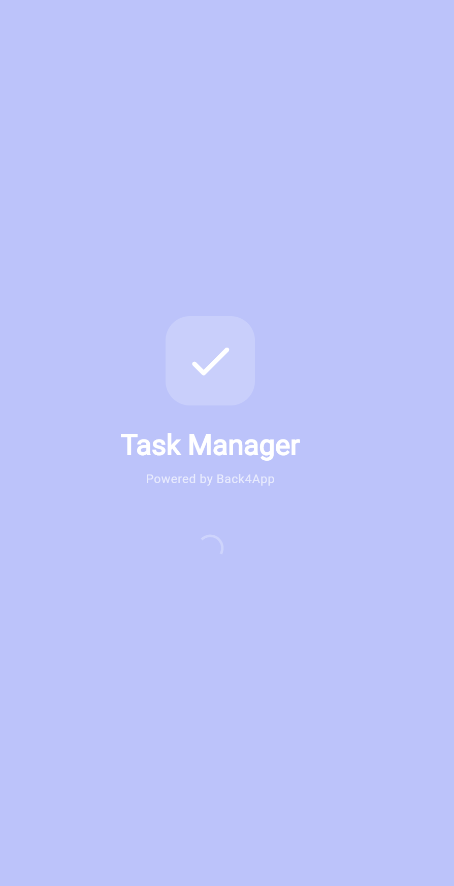
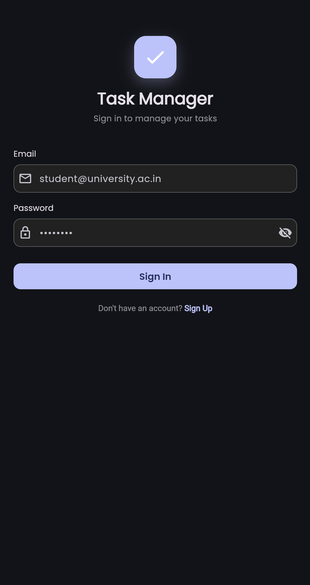
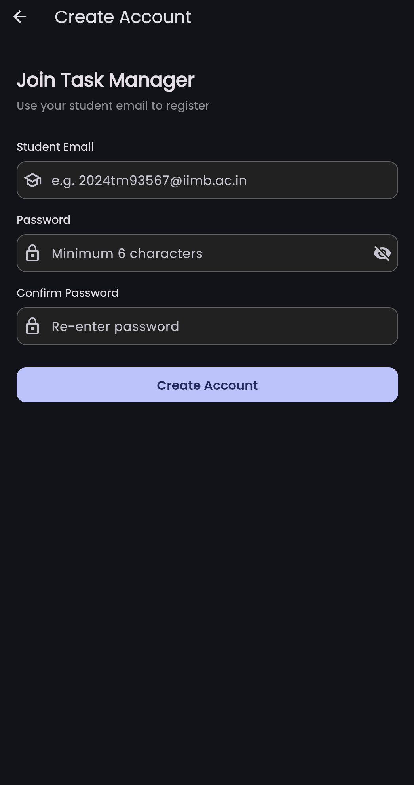
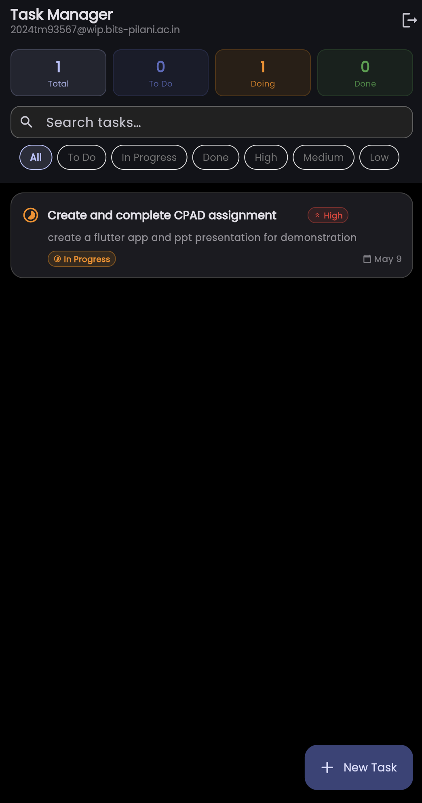
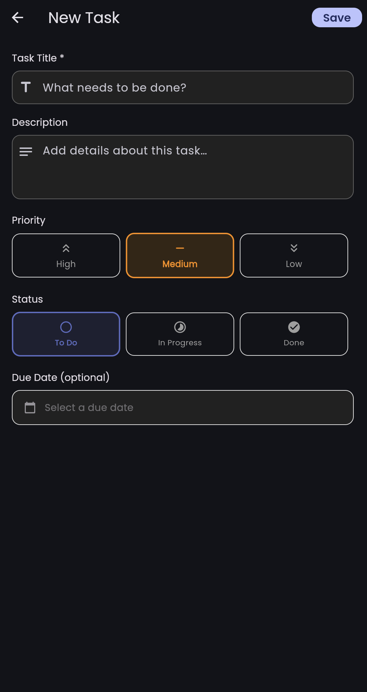
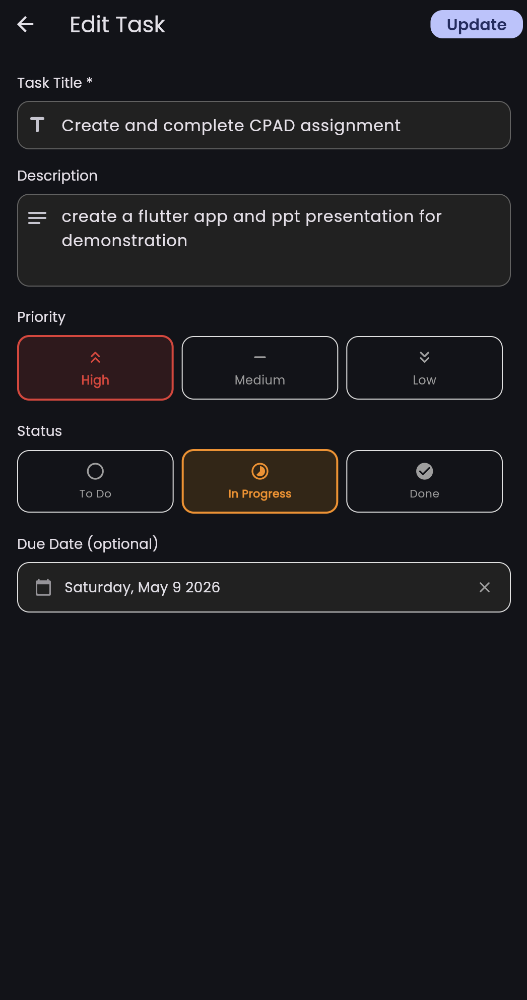
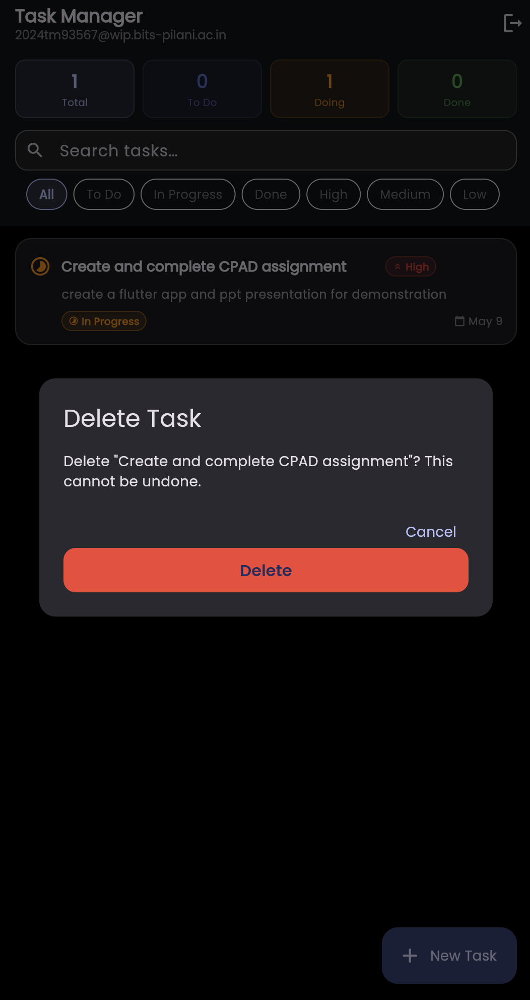

# Task Manager App
### Flutter CRUD Application with Back4App (BaaS)
**CPAD Assignment | BiTS IIT Kharagpur**

---

## Overview

A production-grade Flutter Task Manager that demonstrates full-stack mobile development using **Back4App** as Backend-as-a-Service. Features user authentication, real-time CRUD operations, task prioritisation, and a polished Material 3 UI.

## Features

| Feature | Description |
|---|---|
| **User Auth** | Register / Login / Logout with email — secured by Back4App Parse SDK |
| **Create Tasks** | Title, description, priority (High / Medium / Low), status, due date |
| **Read Tasks** | Real-time list with pull-to-refresh and live stat counters |
| **Update Tasks** | Hover over a task → click ✏️ Edit button, or tap the status icon to cycle Todo → In Progress → Done |
| **Delete Tasks** | Hover over a task → click 🗑️ Delete button → confirmation dialog prevents accidental deletion |
| **Priority System** | Color-coded High / Medium / Low badges |
| **Status Tracking** | Todo → In Progress → Done with one-tap cycling |
| **Due Dates** | Optional due date with overdue highlighting in red |
| **Search & Filter** | Real-time search + filter by status or priority |
| **Dashboard Stats** | Live counts — Total, To Do, Doing, Done, Overdue |
| **Dark Mode** | System-aware Material 3 theming |
| **Smooth Animations** | Staggered card reveals, button springs, shimmer splash |

## Tech Stack

| Layer | Technology |
|---|---|
| Frontend | Flutter 3.x (Dart) |
| Backend | Back4App (Parse Server) |
| Database | Back4App Cloud Database |
| State Management | Provider |
| Fonts | Google Fonts (Poppins) |
| Animations | flutter_animate |
| Gestures | Hover-reveal Edit/Delete actions (web-friendly) |

## Setup Instructions

### 1. Install Flutter

```bash
# macOS (Apple Silicon)
cd ~
git clone https://github.com/flutter/flutter.git -b stable
export PATH="$PATH:$HOME/flutter/bin"
flutter doctor
```

### 2. Create a Back4App App

1. Go to [https://www.back4app.com](https://www.back4app.com) → Sign Up (free)
2. Click **Build new app** → name it `TaskManagerApp`
3. Go to **App Settings → Security & Keys**
4. Copy your **Application ID** and **Client Key**

### 3. Add Your Keys

Edit `lib/config/back4app_config.dart`:

```dart
static const String applicationId = 'YOUR_BACK4APP_APPLICATION_ID';
static const String clientKey    = 'YOUR_BACK4APP_CLIENT_KEY';
```

### 4. Run the App

```bash
cd task_manager
flutter pub get
flutter run
```

## App Screenshots

| Splash | Login | Register |
|--------|-------|----------|
|  |  |  |

| Task List | New Task | Edit Task |
|-----------|----------|-----------|
|  |  |  |

| Delete Confirmation |
|---------------------|
|  |

## Project Structure

```
lib/
├── config/
│   └── back4app_config.dart     # App ID & Client Key
├── models/
│   └── task.dart                # Task model + Priority/Status enums
├── services/
│   ├── auth_service.dart        # Register / Login / Logout
│   └── task_service.dart        # CRUD via Parse SDK
├── providers/
│   └── task_provider.dart       # State management (Provider)
├── screens/
│   ├── splash_screen.dart       # Auth check + animated splash
│   ├── auth/
│   │   ├── login_screen.dart    # Login UI
│   │   └── register_screen.dart # Register UI
│   └── tasks/
│       ├── home_screen.dart     # Task list + stats + filters
│       └── task_form_screen.dart # Create / Edit form
├── widgets/
│   ├── task_card.dart           # Animated task card with hover Edit/Delete actions
│   └── priority_badge.dart      # Priority & Status chip widgets
├── theme/
│   └── app_theme.dart           # Material 3 light + dark themes
└── main.dart                    # App entry point
```

## Back4App Data Schema

**Class: `Task`**

| Field | Type | Description |
|-------|------|-------------|
| `objectId` | String | Auto-generated unique ID |
| `title` | String | Task title (required) |
| `description` | String | Task details |
| `priority` | String | `high` / `medium` / `low` |
| `status` | String | `todo` / `inProgress` / `done` |
| `dueDate` | Date | Optional due date |
| `createdAt` | Date | Auto-set by Parse |
| `updatedAt` | Date | Auto-set by Parse |
| `ACL` | ACL | Per-user access control |

---

*CPAD Assignment — Bits Pilani - WILP
